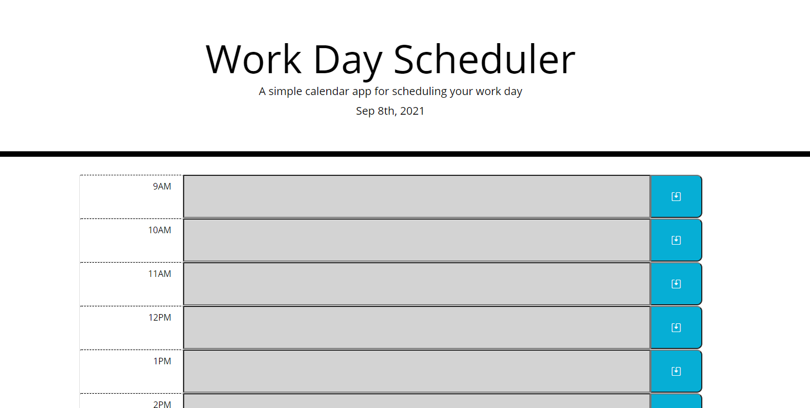

# Work Day Scheduler

This site is a work day scheduler that will dynamically update based on the time of day.

## General Usage

This web application will be very helpful for anyone looking to organize their work schedule.

The application will automatically update the corresponding input boxes with a color that's based on the current time.

If an event is in the past, then it'll turn the row grey.
If an event is in the present, then it'll turn the row red.
If an event is in the future, then it'll turn the row green.

After you have entered in an event that you want to be reminded of later, then click on the Save Icon in the blue box.

This will save the event that you entered to be viewed at a later time -- even upon refresh!

Come back as often as you need!

## License

[MIT](https://choosealicense.com/licenses/mit/)
